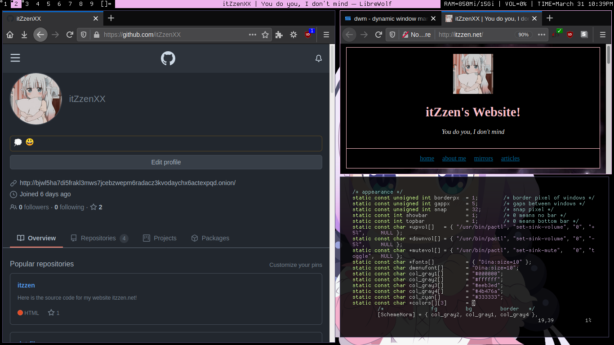
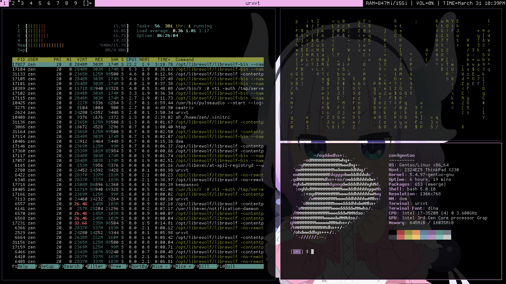

This repository is archived, please view the up to date repository over on codeberg: https://codeberg.org/itZzenXX/zendwm

# ZenDWM
ZenDWM, Zen's configuration for the dynamic window manager by suckless




# Dependencies
Before using my configuration for dwm, please install the required dependencies listed here:

```gentoo: emerge -vq x11-terms/rxvt-unicode x11-misc/dmenu media-fonts/dina```

# Installing
By default, 'config.mk' will point to '/usr' by default, please change this if needed.

After doing so, please run the following command to build and install zendwm. If needed, please run this command as root.

```make -j2 ; make install```

# Running ZenDWM
It is reccomended to use 'startx' using the '~/.xinitrc' config file to start ZenDWM.

Add this line to ~/.xinitrc:

```exec dwm```

Add this line instaid if it's needed to output a log file:

```exec dwm > ~/.dwm.log```

Add this line in ~/.xinitrc if a custom statusbar is desired:

```
while true; do
    xsetroot -name " RAM=$(free -h | awk '/^Mem:/ {print $3 "/" $2}') | VOL=$(amixer get Master | tail -n1 | sed -r 's/.*\[(.*)%\].*/\1/')% | TIME=$(date +"%B %d %l:%M%p"| sed 's/  / /g')"
    sleep .1
done &
```

I hope you enjoy my customized version of dwm!
